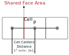

Heat Diffusion Transient
========================

This section discretizes the heat diffusion equation in three dimensions for any arbitrary shape mesh cell using the finite volume method (FVM) for transient conditions. The discretization is based on the general form of the heat diffusion equation, which includes both dependent and independent source terms.

Generic Form of the Heat Diffusion Equation
-------------------------------------------

The heat diffusion equation in three dimensions can be written as:

.. math::

    \rho c_p \frac{\partial T}{\partial t} = \frac{\partial}{\partial x_i}(k \frac{\partial T}{\partial x_i}) + S_T

where:

- :math:`T` is the temperature (dependent variable).
- :math:`\alpha` is the thermal diffusivity (:math:`\alpha = \frac{k}{\rho c_p}`) where

  - :math:`k` is the thermal conductivity.
  - :math:`\rho` is the density of the material.
  - :math:`c_p` is the specific heat capacity.
- :math:`S_T` is a source term.

Discretization in 3D
--------------------

Continuing from the steady state case 

The equation now have the time derivative term which can be integrated over a time step :math:`\Delta t` to yield the following integral form:

.. math::
    :label: eq:heatDiffusionDiscretization-transient
    :nowrap:

    \begin{align}
    \int_{t}^{t+\Delta t} \int_{\Delta V} \rho c \frac{\partial T}{\partial t} dV dt & = \int_{t}^{t+\Delta t} \int_{\Delta V} \left[\frac{\partial}{\partial x}\left(k \frac{\partial T}{\partial x}\right) + S_T\right] dV dt \notag \\
    \rho c (T_{i}-T_{i}^{0}) \Delta V & = \int_{t}^{t+\Delta t} \left( \left[kA \frac{T_{i+1} - T_i}{\Delta x} \right]_{i+1} \right. \notag \\
    & \left. + \left[kA \frac{T_{i-1} - T_i}{\Delta x} \right]_{i-1} + S_u + S_i T_i \right)\ dt
    \end{align}

On the temperature integral of the right side of the equation,we can generalize the equation by means of a weighting parameter :math:`\theta` which can be used to approximate the temperature at the next time step as follows:

.. math::
    :nowrap:

    \begin{align*}
        T_{i}^{n+1} = T_{i}^{n} + \theta \left( T_{i}^{n+1} - T_{i}^{n} \right)
    \end{align*}

where :math:`\theta` is a weighting factor that can be set to 0 for implicit, 0.5 for the Crank-Nicolson method or 1 for the explicit method.

Dropping the superscript for the future time step and using :math:`n = 0` for the current time step, we can express the equation as:

.. math::
    :nowrap:

    \begin{align*}
        T_{i} & = T_{i}^{0} + \theta \left( T_{i} - T_{i}^{0} \right) \\
        T_{i} & = \theta T_{i} + (1-\theta) T_{i}^{0} \\
        \int_{t}^{t+\Delta t} T_{i} dt & = \left[ \theta T_{i} + (1-\theta) T_{i}^{0} \right] \Delta t
    \end{align*}

Thus the equation :eq:`eq:heatDiffusionDiscretization-transient` can be re-written as:

.. math::
    :nowrap:

    \begin{align*}
        \rho c (T_{i}-T_{i}^{0}) \Delta V & = \theta\left(\left[kA \frac{T_{i+1} - T_i}{\Delta x} \right]_{i+1} + \left[kA \frac{T_{i-1} - T_i}{\Delta x} \right]_{i-1} + S_i T_{i}\right) \Delta t \notag \\
        + (1-\theta) & \left(\left[kA \frac{T_{i+1}^{0} - T_i^{0}}{\Delta x} \right]_{i+1} + \left[kA \frac{T_{i-1}^{0} - T_i^{0}}{\Delta x} \right]_{i-1} + S_i T_{i}^{0} \right) \Delta t \notag \\
        & + S_u \Delta V \Delta t
    \end{align*}

Rearrenging them to organize all the unknowns on the left side and knowns on the right side, we can express the equation as:

.. math::
    :label: eq:genericTransientDiffusionDiscretization
    :nowrap:

    \begin{align}
        & - \theta \left[ \frac{kA}{\Delta x} \right]_{i-1} T_{i-1} \notag \\
        & + \left[ \frac {\rho c \Delta V}{\Delta t} + \theta \left\{ \left( \frac{kA}{\Delta x} \right)_{i+1} + \left( \frac{kA}{\Delta x} \right)_{i-1} -S_i \right\} \right] T_{i} \notag \\
        & -\theta \left[ \frac{kA}{\Delta x} \right]_{i+1} T_{i+1} \notag \\
        & = (1-\theta) \left[ \frac{kA}{\Delta x} \right]_{i-1} T^{0}_{i-1}\notag \\
        & + \left[ \frac {\rho c \Delta V}{\Delta t} - (1-\theta) \left\{ \left(\frac{kA}{\Delta x} \right)_{i+1} + \left( \frac{kA}{\Delta x} \right)_{i-1} -S_i \right\}\right] T_{i}^{0} \notag \\
        & +(1-\theta) \left[ \frac{kA}{\Delta x} \right]_{i+1} T^{0}_{i+1} + S_u \Delta V
    \end{align}

This is the generic discretization equation for the transient heat diffusion equation using the finite volume method. The equation can be applied to any arbitrary shape mesh cell by appropriately defining the coefficients based on the geometry, cell connectivity, boundary faces, and material properties of the mesh cell.

If :math:`\theta = 0`, the equation becomes explicit, meaning that the temperature at the next time step is calculated directly from the current temperature and source terms. If :math:`\theta = 1`, it becomes implicit, requiring a system of equations to be solved at each time step. For :math:`\theta = 0.5`, it represents the Crank-Nicolson method, which is a time-centered scheme providing a balance between stability and accuracy. The equation is organized such that all the unknowns (temperatures at the next time step) are on the left side, while all known values (temperatures at the current time step and source terms) are on the right side.

For :math:`\theta = 0`, the equation simplifies to an explicit form as follows

.. math::
    :label: eq:genericTransientDiffusionDiscretization-explicit
    :nowrap:

    \begin{align}
        & \left[ \frac {\rho c \Delta V}{\Delta t} \right] T_{i} \notag \\
        & = \left[ \frac{kA}{\Delta x} \right]_{i-1} T^{0}_{i-1}\notag \\
        & + \left[ \frac {\rho c \Delta V}{\Delta t} - \left\{ \left(\frac{kA}{\Delta x} \right)_{i+1} + \left( \frac{kA}{\Delta x} \right)_{i-1} -S_i\right\} \right] T_{i}^{0} \notag \\
        & +\left[ \frac{kA}{\Delta x} \right]_{i+1} T^{0}_{i+1} + S_u \Delta V
    \end{align}

For :math:`\theta = 1`, the equation simplifies to an implicit form as follows

.. math::
    :label: eq:genericTransientDiffusionDiscretization-implicit
    :nowrap:

    \begin{align}
        & - \left[ \frac{kA}{\Delta x} \right] T_{i-1} \notag \\
        & + \left[ \frac {\rho c \Delta V}{\Delta t} + \left\{ \left( \frac{kA}{\Delta x} \right)_{i+1} + \left( \frac{kA}{\Delta x} \right)_{i-1} -S_i \right\} \right] T_{i} \notag \\
        & -\left[ \frac{kA}{\Delta x} \right] T_{i+1} \notag \\
        & = \left[ \frac {\rho c \Delta V}{\Delta t} \right] T_{i}^{0} \notag \\
        & + S_u \Delta V
    \end{align}

For :math:`\theta = \frac{1}{2}`, the equation translates into a Crank-Nicolson form.

Most interestingly, the equation :eq:`eq:genericTransientDiffusionDiscretization` can be used to derive the steady state heat diffusion equation by setting :math:`\Delta t \to \infty` and :math:`\theta = 1` , which leads to the steady state form of the heat diffusion equation.

.. math::
    :label: eq:genericSteadyDiffusionDiscretization
    :nowrap:

    \begin{align}
        & - \left[ \frac{kA}{\Delta x} \right]_{i-1} T_{i-1} \notag \\
        & + \left[ \left( \frac{kA}{\Delta x} \right)_{i+1} + \left( \frac{kA}{\Delta x} \right)_{i-1} -S_i \right] T_{i} \notag \\
        & -\left[ \frac{kA}{\Delta x} \right]_{i+1} T_{i+1} \notag \\
        & = S_u \Delta V
    \end{align}